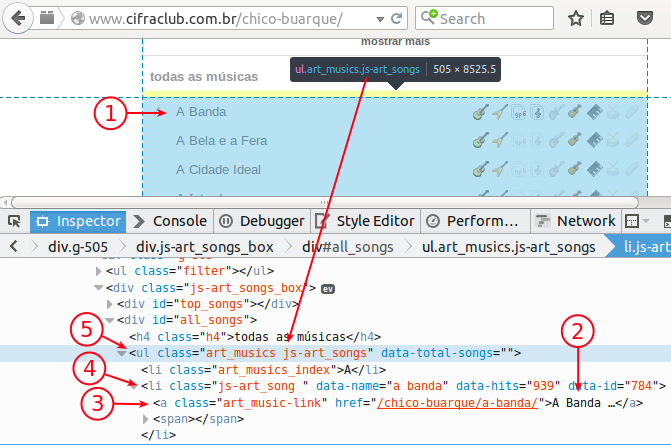

```{r, include = FALSE}
source("../config/setup.R")
```

Se você pensa que o R é apenas uma aplicativo para estatística, você
está enganado. O R vai muito além disso. Nesse *post* vou apresentar
como fazer [*web scraping*][] com o R. Numa tradução bem livre, *web
scraping* é arte de fazer a extração da informação (dados) contida em
páginas web. Como é o primeiro post sobre o tema, não quero complicar,
então o objetivo é simples: obter a distribuição de frequência de
acordes em canções cifradas. Quem tem interesse por isso? Talvez
ninguém, mas não seria possível medir a diversidade musical por meio da
ocorrência dos acordes? Vamos coletar os dados então!

Eu escolhi trabalhar nas canções do cantor e compositor brasileiro
[Chico Buarque de Holanda][]. Serão usadas as cifras disponíveis no
[cifraclub][]. As instruções dadas aqui podem ser adaptadas para outros
artistas, estilos musicais e sites, não necessariamente de cifra de
música.

Para começar, leio a página inicial do artista. Essa é a primeira etapa
porque na *home* do artista estão os nomes e links para todas as canções
dele. Precisamos desses links se quisermos ler as canções e vamos tirar
todos os links da *home* com *web scraping*. O pacote [`XML`][] é o que
permite minerar páginas html. É um pacote oficial do R, então você
instala com um simples `install.packages("XML")`.

O código fonte de documentos html não faz muito sentido para os olhos
humanos devido a quantidade de *tags*, campos que informam ao navegador
a estrutura do documento para que este nos apresente de forma
legível. Em poucas palavras, um documento html constituído dessas tags e
elas estão organizadas em uma [estrutura de árvore][]. Com as funções do
pacote `XML`, podemos percorer os ramos dessa árvore, definir os
nós/bifucações e coletar tudo que existe ali ou dali pra frente. Se você
se interessar por *web scraping*, aconselho procurar compreender bem
essa estrutura de árvore pois isso é fundamental para se especificar a
consulta dentro de uma página.

Para especificar a consulta, o jeito mais simples é usar a ferramenta de
inspecionar elemento do seu navagador. Clique com o botão direito sobre
a página e escolha **inspecionar elemento**. Na janela que se abrir,
você pode navegar pelo código fonte e ver que parte do código fonte
corresponde ao que é mostrado no navegador. O *printscreen* abaixo
esclarece como fiz a minha especificação. A numeração na figura indica
as etapas pelas quais passei.

  1. Primeiro eu usei o inspecionar elemento do navegador
     Firefox. Cliquei no ícone que fica do lado *inspector* (destacado
     de azul). Movi o cursor para a lista de músicas e voltei a atenção
     para a primeira canção: A banda.
  2. Encontrei a canção no código fonte.
  3. Reconheci que a canção era elemento da tag `<a>` (*anchor*). Ainda,
     o elemento possía classe `art_music-link` e o atributo `href`
     (*hypertext reference*) com o link relativo para ir para a cifra.
  4. Reconheci que `<a>` estava dentro de `<li>` (*list item*) e que
     este tinha a classe `js-art_song `. É importante notar que o espaço
     é parte do nome da classe.
  5. Por último, como é previsto pela estrutura html, o `<li>` é parte
     de `<ul>` (*unordered list*), que no caso tinha classe `art_musics
     js-art_songs`.



Mesmo seguro de como montar a consulta pela inspeção do código fonte, na
hora de fazer, eu preferi ir aumentando o nível de detalhe até chegar ao
resultado que eu precisava. Eu deixei o código do argumento `path = `
comentado para mostrar essa trajetória. Surigo que você passe por cada
uma das espeficicações de consulta e veja o resultado.

```{r, messages = FALSE}
#-----------------------------------------------------------------------
# Pacotes.

library(XML)
library(RCurl)
library(lattice)
library(latticeExtra)

#-----------------------------------------------------------------------
# Ler todas as canções de Chico Buarque de Holanda (CHB).

# Canções do CBH do letras.mus.br.
url <- "https://www.cifraclub.com.br/chico-buarque/"
# browseURL(url)

#-----------------------------------------------------------------------
# Examina e decodifica a estrutura de árvore.

h <- htmlParse(getURL(url, .encoding = "utf-8"))

# Frequência das tags na página.
summary(h)

canc <- xpathApply(doc = h,
                   path = "//ul/li/a[@class = 'art_music-link']",
                   fun = function(node) {
                       c(cancao = xmlGetAttr(node, "title"),
                         sulfix = xmlGetAttr(node, "href"))
                   })
canc <- as.data.frame(do.call(rbind, canc),
                      stringsAsFactors = FALSE)
head(canc)
```

Agora que temos em um objeto com os links das canções (`canc`), já
podemos passar para etapa de extrair os acordes de cada uma delas. Vamos
mostar o *web scraping* para uma página com música cifrada. A canção
escolhida foi a [trocando um miúdos][]. Eu particularmente gosto da
versão da [Alcione com o Emílio Santiago][]. O *printscreen* que
orientou minha consulta e os números indicam as etapas.

  1. Indentifiquei na página o acorde `CM7` (Dó com sétima maior).
  2. Encontrei o acorde no código fonte.
  3. Reconheci que estava dentro da tag `<b>` (*bold*) e que tinha uma
     classe vazia.
  4. Vi que todo o texto da canção estava dentro da tag `<pre>`
     (*preformatted*).
  5. Vi que que `<pre>` estava dentro da tag `<div>` que tinha classe
     `cifra_cnt cifra-mono`.

Da mesma forma de antes, eu fui aumentando o nível de detalhe da
consulta. Mantive o código comentado para que você fazer também.


```{r}
#-----------------------------------------------------------------------
# Lendo uma canção para contar o número de acordes que aparecem.

# Número da canção.
i <- grep("trocando", x = canc$cancao, ignore.case = TRUE)
canc$sulfix[i]

url <- paste0("https://www.cifraclub.com.br",
              "/chico-buarque/trocando-em-miudos/")
# browseURL(url)
h <- htmlParse(getURL(url, .encoding = "utf-8"))

path <- "//div[@class = 'cifra_cnt g-fix cifra-mono']/pre/b"
chords <- xpathSApply(doc = h,
                      path = path,
                      fun = xmlValue)
# chords

tb <- xtabs(~chords)
cbind(sort(tb, decreasing = TRUE))

# Número de acordes distintos.
length(tb)
```

Supondo que todas as canções têm páginas com a mesma estrutura,
espera-se que o código acima apresentado possa ser aplicado em batelada,
ou seja, sequencialmente canção por canção, link após link. Por outro
lado, eu conheço um pouco essas páginas de cifras e posso adiantar que
as cifras não tem o mesmo padrão. Por exemplo, quando a canção tem
melodia igual em várias partes, as vezes o colaborador da cifra só
coloca acordes na primeira parte e no refrão. O músico entende que a
cifra se repete para as outras partes da música. Isso não é um problema
em nossa aplicação pois o interesse é o número de acordes
distintos. Seria problemático se o interesse fosse o número total de
acordes, por exemplo.

```{r, cache = TRUE}
#-----------------------------------------------------------------------
# Lendo todas as canções para fazer a distribuição de frequências.

# Urls que terminal com "letra/" são de canções sem cifra. Removê-las.
i <- grep("letra/$",
          invert = TRUE,
          x = canc$sulfix)
canc <- canc[i, ]

urls <- paste0("https://www.cifraclub.com.br", canc$sulfix)
names(urls) <- canc$cancao

chand <- getCurlHandle(useragent = "cifras",
                       followlocation = TRUE,
                       cookiefile = "")

# Função que extrai os acordes da canção.
extractChords <- function(url) {
    h <- htmlParse(getURL(url, .encoding = "utf-8", curl = chand))
    path <- "//div[@class = 'cifra_cnt g-fix cifra-mono']/pre/b"
    chords <- xpathSApply(doc = h,
                          path = path,
                          fun = xmlValue)
    return(length(unique(chords)))
}

# Tempo gasto com a tarefa. Depende mais de conexão do que de poder de
# processamento da máquina.
system.time(chords <- sapply(urls, FUN = extractChords))

# Algumas páginas dão 0 acordes devido os acordes não estarem em negrito
# (dentro de <b></b>). Uma canção tem que ter no mínimo dois acordes.
xtabs(~chords)
chords <- chords[chords >= 2]
```

Com auxílio dos gráficos e das medidas descritivas, pode-se perceber que
as canções cifradas do Chico Buarque têm em média 24 acordes. Pelo menos
75% das canções têm 30 acordes ou menos. A distribuição é assimétrica a
direita e o desvio padrão é 12.02.

```{r, cache = FALSE, fig.weight = 7, fig.height = 4}
# Distribuições de frequência.
p1 <- ecdfplot(~chords,
               col = 1,
               xlab = "Número de acordes distintos",
               ylab = "Distribuição acumulada de frequência relativa") +
    layer(panel.abline(h = 0.5, lty = 2))

p2 <- densityplot(~chords,
                  n = 512,
                  from = 2,
                  col = 1,
                  xlab = "Número de acordes distintos",
                  ylab = "Densidade empírica") +
    layer(panel.abline(v = 23, lty = 2))

plot(p1, split = c(1, 1, 2, 1), more = TRUE)
plot(p2, split = c(2, 1, 2, 1))

#-----------------------------------------------------------------------
# Medidas descritivas.

EnvStats::summaryFull(chords)
```

Será que os estilos musicais tem uma distribuição para o número de
acordes muito distinta uns dos outros? Certos acordes ocorrem mais em
certos estilos que outros, como por exemplo, acordes maiores com sétima
maior `7M`? Muitas perguntas podem ser formuladas e talvez muitas possam
ser respondidas por conseguirmos extrair os dados necessários com *web
scraping*. Baixe o arquivo R com os códigos mostrados nesse post:
[script.R][].

<!------------------------------------------- -->

[*web scraping*]: https://en.wikipedia.org/wiki/Web_scraping
[Chico Buarque de Holanda]: http://www.cifraclub.com.br/chico-buarque/
[cifraclub]: http://www.cifraclub.com.br/
[`XML`]: https://cran.r-project.org/web/packages/XML/index.html
[estrutura de árvore]: http://docstore.mik.ua/orelly/web2/css/figs/css.0218.gif
[trocando um miúdos]: http://www.cifraclub.com.br/chico-buarque/trocando-em-miudos/
[Alcione com o Emílio Santiago]: https://www.youtube.com/watch?v=R9vNTxh4GVE
[script.R]: http://blog.leg.ufpr.br/~walmes/2015-08-26_webScrapChico.R
