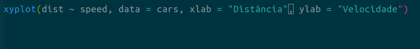

```{r, include = FALSE}
source("../config/setup.R")
```

O GIF abaixo ilustra um recurso fantástico do Emacs: arranjar o código
no alternando entre 1) manter a forma original (manter), 2) quebrar
linhas para caber sem ultrapassar a margem (acomodar) e 3) dispor um
argumento por linha (verticalizar).  Nessa matéria eu não vou descrever
como habilitar isso no Emacs nem de detalhes sobre essa funcionalidade.
Vou descrever como fiz para criar o GIF.



## Opções para criar GIFs

Para criar um GIF existem pelo menos 3 opções.

  1. Se você tem uma sequência de imagens, pode criar o GIF usando o
     GIMP ou ImageMagick.  O pacote [`animation`] contém recursos
     para criação de GIFs a partir de sequências de gráficos.
  2. Se você tem um vídeo, pode convertê-lo para GIF também.  Esse é o
     recurso que os internautas usam para criar os gif memes, por
     exemplo.
  3. Se não tem nenhum dos anteriores, pode gravar a tela e produzir o
     GIF sem passar pelos estados intermediários (sequência de imagens
     ou vídeo).  Essa é a solução que descreverei nessa matéria.

## Gravar a janela de uma aplicação

Para gravar a tela será utilizado o [`byzanz`].  O [`xwininfo`] será
empregado para obter informações sobre as coordenadas e dimensões das
janelas das aplicações e coordenadas do cursor.  O `xwininfo` pertence o
pacote [`x11-utils`], conforme o comando `apt-cache search` informa.
Clique nos hyperlinks sob os nomes para visitar as documentações.

```{r, engine = "sh", eval = FALSE}
apt-cache search byzanz
apt-cache search xwininfo
```

Abra um terminal e execute `apt-get install` para instalar os pacotes no
Ubuntu.

```{r, engine = "sh", eval = FALSE}
# Instalação.
sudo apt-get install byzanz x11-utils

# Exibe a documentação.
byzanz-record --help
xwininfo --help
```

Para gravar a tela, o `byzanz` precisa das coordenadas, da duração da
gravação (segundos) e do caminho para criar o arquivo.  A posição da
janela a ser gravada é definida pelas coordenadas no canto superior
esquerdo (x, y), largura e altura (width, height) da janela.  O
`xwininfo` retorna as informações da janela após clicarmos nela.  Basta
executar `xwininfo` no terminal que o cursor mudará o ponteiro de de
flecha para cruz aguardando que se clique em alguma janela.  Alterne
entre janelas com <kbd>ALT</kbd> + <kbd>TAB</kbd> e clique na desejada.

```{r, eval = FALSE}
system("xwininfo")
```
```
xwininfo: Please select the window about which you
          would like information by clicking the
          mouse in that window.
```

Para ilustrar, podemos obter as informações da janela de gráficos do R.
Execute o código R abaixo para criar o gráfico.  Com a função `system()`
executamos o `xwininfo` de dentro do R e guardamos o output produzido em
um objeto (requer `intern = TRUE`).

```{r, eval = FALSE}
library(lattice)

# x11(width = 5, height = 4)
xyplot(dist ~ speed,
       data = cars,
       xlab = "Distância",
       ylab = "Velocidade")
```

```{r, include = FALSE}
# dput(xinfo)
xinfo <- c("",
           "xwininfo: Please select the window about which you",
           "          would like information by clicking the",
           "          mouse in that window.",
           "",
           "xwininfo: Window id: 0x4a00001 \"R Graphics: Device 2 (ACTIVE)\"",
           "",
           "  Absolute upper-left X:  57",
           "  Absolute upper-left Y:  52",
           "  Relative upper-left X:  0",
           "  Relative upper-left Y:  0",
           "  Width: 479",
           "  Height: 385",
           "  Depth: 24",
           "  Visual: 0x45",
           "  Visual Class: TrueColor",
           "  Border width: 0",
           "  Class: InputOutput",
           "  Colormap: 0x47 (installed)",
           "  Bit Gravity State: ForgetGravity",
           "  Window Gravity State: NorthWestGravity",
           "  Backing Store State: Always",
           "  Save Under State: no",
           "  Map State: IsViewable",
           "  Override Redirect State: no",
           "  Corners:  +57+52  -1384+52  -1384-643  +57-643",
           "  -geometry 479x385+47+14",
           "")
```

```{r, eval = FALSE}
xinfo <- system("xwininfo", intern = TRUE)
```
```{r}
# Resultado completo do `xwininfo`.
cat(xinfo, sep ="\n")
```

O `xwininfo` retorna várias informações sobre a janela, das quais,
apenas 4 serão usadas: as coordenadas do canto superior esquerdo,
largura e altura, que selecionados com o `grep()`.

```{r}
# Extraindo a coordenada do canto superior esquerdo, largura e altura.
i <- grep("Absolute upper-left X", x = xinfo) + c(0, 1, 4, 5)
xinfo[i]
```

Os argumentos do `byzanz` são exibidos abaixo, com os tipos de valores
indicados com `<tipo>`. A duração (`--duration=`) da gravação é em
segundos, as coordenadas são valores inteiros na unidade de pixels e o
último é o caminho para criar o arquivo GIF.

```sh
byzanz-record --duration=<num> \
    --x=<int> --y=<int> --width=<int> --height=<int> \
    </caminho/para/criar/arquivo.gif>
```

A função `byzanz()` foi criada para executar o `byzanz` de dentro do R.
Os três argumentos são o caminho para o arquivo, a duração da gravação e
a geometria da janela (coordenadas, largura e altura).

```{r}
# Função que gera o gif fazendo a gravação com o byzanz.
byzanz <- function(path, dur, geom) {
    stopifnot(dur > 0)
    stopifnot(length(geom) == 4L)
    stopifnot(all(geom >= 0))
    cmd <- paste0("byzanz-record",
                  " --duration=", dur,
                  " --x=", geom[1],
                  " --y=", geom[2],
                  " --width=", geom[3],
                  " --height=", geom[4],
                  " ", path)
    system(cmd)
}

# Extrai os valores de cada campo.
geom <- as.integer(gsub(".*: *(\\d+)$", "\\1", xinfo[i]))
geom

# Caminho para criar o arquivo e duração da gravação (segundos).
path <- "~/Downloads/teste.gif"
dur <- 5

byzanz(path, dur = 4, geom = geom)
```

## Gravar um retângulo qualquer sobre a tela

Gravar um retângulo qualquer é tão simples quanto gravar uma janela.  O
único detalhe é sobre determinar as coordenadas do retângulo que se
deseja gravar.  Existem ao menos duas opções simples.

  1. Usar `xdotool getmouselocation` para determinar a coordenada do
     mouse.  Execute o comando com o mouse no canto superior esquerdo e
     depois com ele no canto inferior direito.  Use as coordenadas
     retornadas para executar o `byzanz`.
  2. Faça um retângulo usando o [`shutter`], uma ferramenta de
     screenshot.  O `shutter` tem um recurso de tirar screenshot de um
     retângulo demarcado com mouse sobre a tela.  Ao traçar o retângulo,
     o `shutter` exibe as coordenadas dele.

```sh
apt-cache search xdotool
apt-cache search shutter

sudo apt-get install xdotool shutter
```

Vou ilustrar com o `xdotool` com os comandos abaixo.  Lembre-se de
alternar entre aplicações sem usar o mouse, pois ele deve estar na
posição que demarca o retângulo que você vai capturar.  Então use os
atalhos de teclado para alternar aplicações.

```{r, eval = FALSE}
# Deixe o mouse no canto superior esquerdo. Volte para o R e execute.
system("xdotool getmouselocation")
```
```
x:61 y:150 screen:0 window:73400491
```
```{r, eval = FALSE}
# Mova o mouse para o canto inferior direito. Volte para o R e execute.
system("xdotool getmouselocation")
```
```
x:905 y:150 screen:0 window:73400491
```
```{r, eval = FALSE}
# Passe as informações para o byzanz.
byzanz(path, dur = 4, geom = c(61, 150, 905 - 61, 250 - 150))
```

Os valores para `width` e `height` foram as diferenças entre as
coordenadas `x` e `y` nas duas posições.

```{r, engine = "sh", include = FALSE, eval = FALSE}
echo -e "\e[?1000h"
while read -n 6; do xdotool getmouselocation; done
```

[`animation`]: https://yihui.name/animation/
[`byzanz`]: https://linux.die.net/man/1/byzanz-record
[`xwininfo`]: https://linux.die.net/man/1/xwininfo
[`x11-utils`]: https://launchpad.net/ubuntu/+source/x11-utils
[`shutter`]: http://shutter-project.org/
