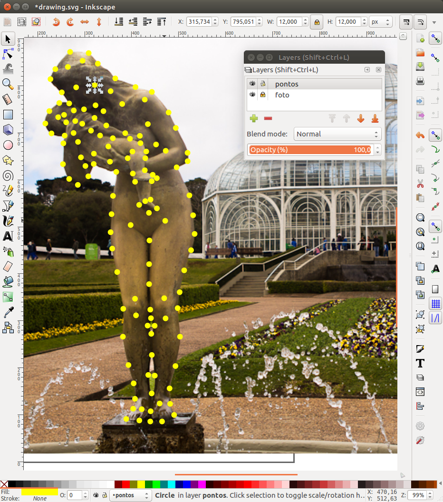
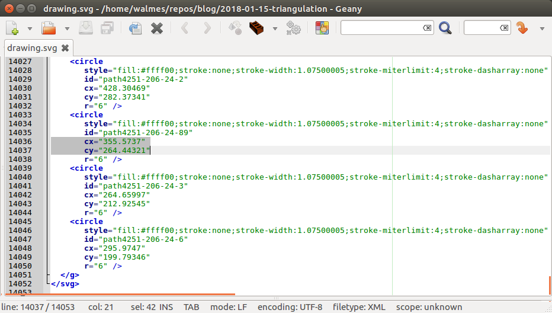

```{r, include = FALSE}
source("../config/setup.R")
```

# O problema

Este ano, a 63 RBras acontece em Curitiba.  Para fazer a logo do evento,
decidimos combinar elementos dos cartões postais da cidade com aqueles
referentes ao tema do evento.  Fazendo buscas por referências na
internet, a imagem de um cérebro feito com triangulação criou uma
sugestão: representar a estátua do Jardim Botânico usando a
triangulação.

<!-- Cerébro -->


<!-- Mãe com o bebê, estátua do Jardim Botânico -->


```{r, cache = TRUE}
# Baixa a imagem.
url <- paste0("http://www.nerdsviajantes.com/wp-content/",
              "uploads/2014/02/jardim-botanico-curitiba-1.jpg")
download.file(url, destfile = "foto.jpg")
```

# Criar os vértices

Vou ser bem sincero aqui.  A minha primeira tentativa foi fazer o
desenho na mão.  Ou seja, criar os pontos e as ligações, usando o
[Inkscape].  Porém, assim que comecei já percebi que levaria tempo e
estaria sujeito a imperfeição.  Meu lado programador e curioso despertou
trazendo recordações relacioandas a SPDE feito com o INLA.  A imagem a
seguir veio à mente.


Pensei então que eu pudesse cortar caminho fazendo as ligações entre
pontos com o R, aplicando o mesmo algoritmo usado para triangular dentro
do polígono do Paraná.  Então eu consultei o especialista em INLA do
LEG, Elias Teixeira Krainski -- possivelmente o autor dessa imagem --
que me auxilou com alguns códigos mas que ainda não resolviam por
completo meu problema.

Eu continuei as buscas usando variações dos termos "triangular mesh 2D
coordinates array". Com isso, passei por implementações feitas em
[Python] e tutoriais no [Wolfram].  Até que em um dos resultados
encontrei o nome do algoritmo.  Meus problemas acabaram e encontrei
imediatamente o pacote [`deldir`], para R, que implementa a
[triangulação de Delaunay].

O pacote [`deldir`] é desenvolvido pelo professor acadêmico honorário
[Rolf Turner] da Univesidade de Auckland, Nova Zelândia.  Esse pacote
tem funções que calculam a [triangulação de Delaunay] e a tecelagem de
Voronoi para um conjunto de pontos no plano 2D (exatamente o que eu
procurava).  A [triangulação de Delaunay] e a tecelagem de Voronoi são
conceitos relacionados e ambos são utilizados em estatística espacial e
modelagem 3D de objetos, como as de filme de animação.

Agora eu já tinha o algorítmo e, graças a seção *examples* do
documentação, eu aprendi usá-lo rapidamente, foi a hora de tentar a
abordagem com a imagem da estátua do Jardim Botânico.  Os passos abaixo
indicam o que fiz no Inkscape.

  1. Criar duas camadas (layers). Uma para a foto (foto) e outra para os
     pontos (pontos).
  2. Importar a imagem para a camada foto e ajustar tamanho.
  3. Com a camada pontos ativa, criar os pontos de demarcação.  Para
     isso eu fiz um círculo de 6 px de diâmetro (círculos amarelos) e
     com cópias do círculo (ctrl-c e ctrl-v) fui demarcando o desenho
     (ver figura abaixo).
  4. Por fim, salvei o arquivo com o nome sugerido, `drawing.svg`.



O SVG significa *Scalable Vector Graphics* é um formato vetorial de
imagem baseado em XML.  Abra o arquivo SVG em um editor de texto para
ver o código fonte.  Você irá vislumbrar que as informações geométrica
estão descritas no arquivo.  Na figura a seguir, destaco os valores para
as coordenadas de um dos círculos.

O arquivo SVG foi lido no R para extração das
coordenadas dos círculos que são os valores dos atributos `cx` e `cy`
dos nós com nome `circle`.  O código abaixo descreve esse passo.



```{r, message = FALSE}
library(XML)

# Lê e decodifica o arquivo.
x <- htmlParse(file = "drawing.svg")
summary(x)

# Extrai o par de valores `cx` e `cy` de cada `circle`.
xy <- xpathSApply(doc = x,
                  path = "//circle",
                  fun = function(i) {
                      as.numeric(c(x = xmlGetAttr(i, name = "cx"),
                                   y = xmlGetAttr(i, name = "cy")))
                  })
xy <- t(xy)
str(xy)

# Rebate verticalmente os pontos.
xy[, 2] <- -xy[, 2]

# Plotagem de inspeção e indentificação de problemas.
# plot(xy, asp = 1)
# identify(xy[, 1], xy[, 2], 1:nrow(xy))

# Remove misterioso outlier que surgiu.
xy <- xy[-107, ]

# Gráfico com ligação cronológica dos pontos.
plot(xy, asp = 1, type = "o")
```

A aplicação da triangulação de Delaunay é a parte mais fácil.  É
simplesmente aplicar a função sobre a matriz de pontos.  Por fim, os
gráfico resultando é exportado para SVG novamente para que algumas
ligações sejam manualmente eliminadas.

Como o SVG é um fomato vetorial, é possível editar propriedades de
gráficos gerados no R com editores vetoriais como o Inkscape e Corel
Draw.  É possível modificar desde fontes usadas nos texto até o
prechimento de pontos de barras nos gráficos.  As revistas científicas
poderiam solcitar arquivos em SVG para publicação pois seria muito mais
fácil dar acabamento.

```{r}
library(deldir)

# Triangulação de Delaunay.
tri <- deldir(x = xy[, 1],
              y = xy[, 2])

# Resultado da triangulação.
plot(tri,
     wlines = "triang",
     asp = 1)

# Salvando em outro arquivo SVG para dar acabamento.
svg("mother-network.svg")
plot(xy,
     type = "n",
     asp = 1,
     xaxt = "n",
     yaxt = "n",
     ann = FALSE,
     axes = FALSE)
plot(tri,
     wlines = "triang",
     wpoints = "none",
     number = FALSE,
     add = TRUE,
     lty = 1)
points(xy,
       pch = 19,
       col = "black",
       cex = 0.6)
dev.off()
```

# O acabamento

Para eliminar algumas ligações, volto novamente para o Inkscape.  A foto
foi importada para indicar quais ligações remover.  Na figura a seguir,
os seguimentos em rosa foram eliminados.


A próxima figura é o resultado do processo todo.  Essa imagem agora
será usada para compor a logo da 63 RBras.


<!------------------------------------------- -->

[`deldir`]: https://cran.r-project.org/web/packages/deldir/index.html
[Rolf Turner]: https://www.stat.auckland.ac.nz/people/ttur023
[triangulação de Delaunay]: https://pt.wikipedia.org/wiki/Triangulação_de_Delaunay
[Python]: https://stackoverflow.com/questions/9422895/constructing-triangular-mesh-for-3-dimensional-data-surface-data-in-python
[Wolfram]: https://www.wolfram.com/mathematica/new-in-10/data-and-mesh-regions/delaunay-meshes.html
[Inkscape]: https://inkscape.org/pt-br/
