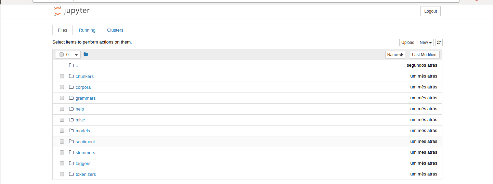
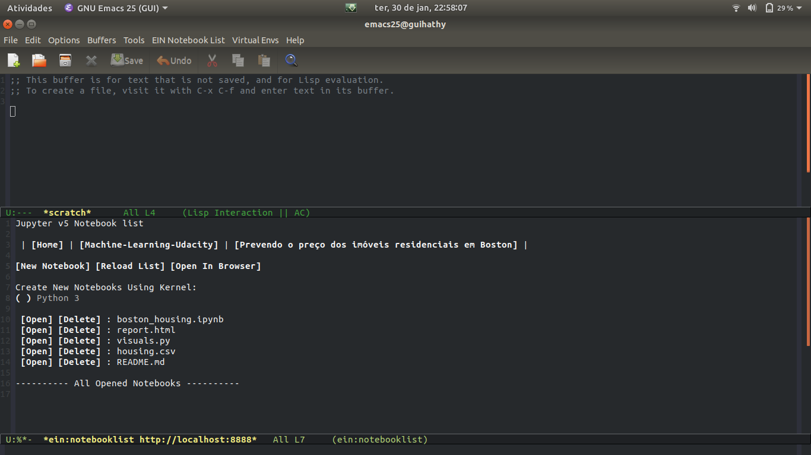

```{r, include = FALSE}
# Carrega as configurações.
source("../config/setup.R")
```
# Jupyter Notebook

Continuando o tema abordado pelo Professor Fernando Mayer no último
[post](http://blog.leg.ufpr.br/archives/363), neste aboraremos o uso
do Jupyter, mais especificamente o Jupyter Notebook, com o
Emacs.

## Mas afinal, o que é um Jupyter Notebook?

Muitos dos alunos do curso de Estatística estão familiarizados com a
utilização do RMarkdown para a elaboração de trabalhos acadêmicos.
De forma bem simplificada, o Jupyter Notebook faz o mesmo trabalho,
integrando código e texto, assim facilitando a escrita de textos
científicos, pesquisas reproduzíveis, relatórios de dados, etc.
O Jupyter é uma ferramenta muito poderosa, pois permite criar
documentos utilizando várias linguagens de programação, como R, Julia e Python.

### Instalando o Jupyter

Podemos instalar o Jupyter utilizando o próprio `pip`.
Basta executar o código abaixo no terminal do Linux.

```{sh, eval=FALSE}
# Instala o Jupyter no Python 3 do sistema.
sudo pip3 install -U jupyter
```

Para abrir um Jupyter Notebook basta rodar o seguinte código no
terminal.

``` {sh, eval=FALSE}
jupyter notebook
```

Após a execução, o seu navegador padrão abrirá com uma tela semelhante
a seguinte.




Para maiores informações de como utilizar o Jupyter, consulte a
documentação oficial: <http://jupyter.org/documentation>.

## Instalando o EIN - Emacs IPython Notebook

Para trabalhar com o Jupyter Notebook no Emacs utilizaremos o pacote
[Ein](https://tkf.github.io/emacs-ipython-notebook/).

A principal motivação para rodar o Jupyter no Emacs é a utilização de
atalhos e ferramentas do proprio Emacs. Eu, por exemplo, costumo utilizar
muito o pacote [multiple-cursors](https://github.com/magnars/multiple-cursors.el),
que permite a edição de várias linhas do código simultaneamente.

A instalação do Ein deve ser feita através do MELPA, que é o
procedimento padrão para se instalar qualquer pacote no Emacs. Para
habilitar o MELPA (se ainda não estiver habilitado) veja esse
[link](https://www.emacswiki.org/emacs/MELPA). Com o MELPA habilitado, execute:

```
M-x package-list-packages
```

para abrir a lista de pacotes disponíveis. Procure pelo Ein
com

```
C-s Ein
```

e aperte <kbd>Enter</kbd> para instalar automaticamente. Por fim,
abra seu `~/.emacs` e insira essas instruções para habilitar Ein:

```
(package-initialize)
(require 'ein)
(require 'ein-loaddefs)
(require 'ein-notebook)
(require 'ein-subpackages)
```

Após inserir salve com <kbd>C-x C-s</kbd> e reinicie o Emacs.

### Iniciando um Notebook no Emacs

Após a instalação do pacote Ein, podemos começar à utilizar o Jupyter
Notebook integrado com o Emacs.

Para começar devemos iniciar um servidor do Jupyter no computador.
Para isso abrimos o Emacs e executamos o comando `M-x ein:jupyter-server-start`.
Em seguida devemos colocar o local no qual esta instalado o Jupyter `Server Command:
/usr/local/bin/jupyter` (Pasta padrão no Ubuntu) e por último colocamos
o caminho para o diretório que queremos iniciar o Jupyter Notebook.

Se tudo ocorrer sem erro, o Emacs abrirá uma janela para a administração dos notebooks.



Para criar um novo Notebook basta clicar em `New Notebook`. Um arquivo com o nome `Untitled.ipynb`
será criado no diretório em que o Jupyter está sendo executado.

Para renomear o Notebook basta usar o comando

```
C-x C-w
```

## Principais Atalhos

Separei alguns dos principais atalhos para a utilização do pacote Ein.
A lista completa pode ser acessada no [link](https://tkf.github.io/emacs-ipython-notebook/#commands-keybinds).

  - `C-c C-c` para executar a cell e permanecer nela.
  - `M-RET` executa a cell e vai para a próxima, caso não tenha, ele cria uma.
  - `C-c C-a` para inserir uma cell antes da cell na qual estamos.
  - `M-up` ou `M-down` para trocar a cell de posição.
  - Após criar uma nova cell, `C-c C-u m` faz ela virar uma markdown cell.
