<!--
ATTENTION --------------------------------------------------------------

Não apague as marcações START e END nesse documento. Elas servem para
delimitar a extração do corpo do HTML gerado ao final. Veja no último
chunk instruções com `awk` e `sed` para isso. O conteúdo do arquivo
`post.html` é que deve ser enviado para o blog.

------------------------------------------------------------------------
-->

<div class="fluid-row" id="header">
<h1 class="title toc-ignore">GNU Emacs para desenvolvimento de scripts R e Python</h1>
<h4 class="author"><em><a href="mailto:walmes@ufpr.br">Walmes Zeviani</a></em></h4>
<h4 class="date"><em>2018-05-07</em></h4>
</div>

<style type="text/css">
div.figure p.caption {
    text-align: left !important;
}

h1.title {
    width: 70%;
    text-align: center;
    margin: 1em auto auto auto;
    display: block;
}
.author,
.date {
    text-align: center;
    margin: 1em auto;
    display: block;
}
</style>

<!-- %% START %% -->
<!-- markdown-toc start - Don't edit this section. Run M-x markdown-toc-refresh-toc -->

- [Introdução](#introdução)
- [Instalação do GNU Emacs](#instalação-do-gnu-emacs)
    - [Pelo Synaptic](#pelo-synaptic)
    - [Pelo Terminal](#pelo-terminal)
- [Instalação de pacotes no GNU Emacs](#instalação-de-pacotes-no-gnu-emacs)
    - [Com o gerenciador de pacotes](#com-o-gerenciador-de-pacotes)
    - [Com comandos em LISP](#com-comandos-em-lisp)
- [Habilitar GNU Emacs para R e Python](#habilitar-gnu-emacs-para-r-e-python)
    - [Para scripts Python](#para-scripts-python)
    - [Para scripts R](#para-scripts-r)
- [Resumão para o impaciente](#resumão-para-o-impaciente)
- [Para Windows e Mac OS](#para-windows-e-mac-os)

<!-- markdown-toc end -->

```{r, include = FALSE}
library(knitr)
opts_chunk$set(cache = FALSE,
               tidy = FALSE,
               fig.width = 7,
               fig.height = 7,
               # out.width = "75%",
               fig.align = "center",
               eval.after= "fig.cap",
               warning = FALSE,
               error = FALSE,
               message = FALSE)
```

# Introdução

O [GNU Emacs](https://www.gnu.org/software/emacs/) é um editor de texto
extensível, customizável e livre.  É desenvolvido pela Free Software
Foundation.

Diferente de uma IDE (Integrated Development Environment), como o
[RStudio](https://www.rstudio.com/) para R ou
[Spyder](https://pythonhosted.org/spyder/) para Python, o GNU Emacs é um
editor geral com o qual se pode trabalhar com várias linguagens de
programação de maneira eficiente e uniforme em um único editor.  Ou
seja, caso você precise trabalhar com várias linguagens, pode-se usar o
GNU Emacs ao invés de aprender várias IDE separadas.

Além da vasta capacidade de edição de linguagens, o Emacs permite

  * edição remota de arquivos ([TRAMP](https://www.gnu.org/software/tramp/)),
  * operações em diretórios ([DirEd](https://www.gnu.org/software/emacs/manual/html_node/emacs/Dired.html)),
  * monitorar processos no sistema operacional ([proced](https://www.masteringemacs.org/article/displaying-interacting-processes-proced)),
  * usar sistemas de controle de versão ([Magit](https://magit.vc/)) e
  * trabalhar como [cliente de banco de dados](https://truongtx.me/2014/08/23/setup-emacs-as-an-sql-database-client).

Estamos apenas citando algumas funcionalidades.

Isso faz do GNU Emacs uma excelente opção para Cientista de Dados.

A comunidade do GNU Emacs é grande e ativa.  Estes usuários
desenvolvem funcionalidades únicas para esse editor e também implementam
recursos interessantes de outros editores, como a [navegação de
página](https://github.com/zk-phi/sublimity) do Sublime e navegação de
[árvore de diretório](https://github.com/zk-phi/sublimity) disponível em
muitas IDE.

Esse documento contém o passo a passo para instalar o Emacs e
habilitá-lo para trabalhar com scripts R e Python.  Nele é detalhado o
processo de instalação para distribuições Ubuntu e Linux Mint.  O Ubuntu
utilizado foi o 16.04 LTS e versão do Emacs atual para ele é a 24.5.1.

Para instalar no Windows ou Mac OS, pule para a [última
seção](#para-windows-e-mac-os) e leia o restante apenas se precisar
habilitar o Python.

Caso queira mais funcionalidades do que as consideradas nesse guia,
estude o repositório: <https://github.com/walmes/emacs>.

# Instalação do GNU Emacs

A instalação do GNU Emacs pode ser feita de duas formas: i) gráfica pelo
gerenciados de pacotes (*Synaptic Package Manager*) ou 2) via comandos
no Terminal do GNU Linux.  Se você preferir a primeira opção, lembre-se
de instalar o *Synaptic* pela Central de Software ou direto via Terminal
executando `sudo apt-get install synaptic`.  Se preferir a segunda
opção, pule para instalação [pelo Terminal](#pelo-terminal).

## Pelo Synaptic

Abra o Synaptic pelo Dash do Ubuntu (exemplo na Figura
\@ref(fig:scr06)).  Clique em *Search* (1) e então busque por `emacs` na
caixa de dialógo (2) que abrir.  Verifique se nos resultados irão
aparecer o `emacs` e `emacs-goodies-el`.  Verifique se as versões são as
mesmas, pois elas podem ser mais atuais, o que não é um problema.

(ref:syn01) Tela do Synaptic fazendo a busca por `emacs`.  Os resultados
exibem `emacs`, `emacs-goodies-el` e outros começando com `emacs24`.

```{r, echo = FALSE, fig.cap = "(ref:syn01)"}
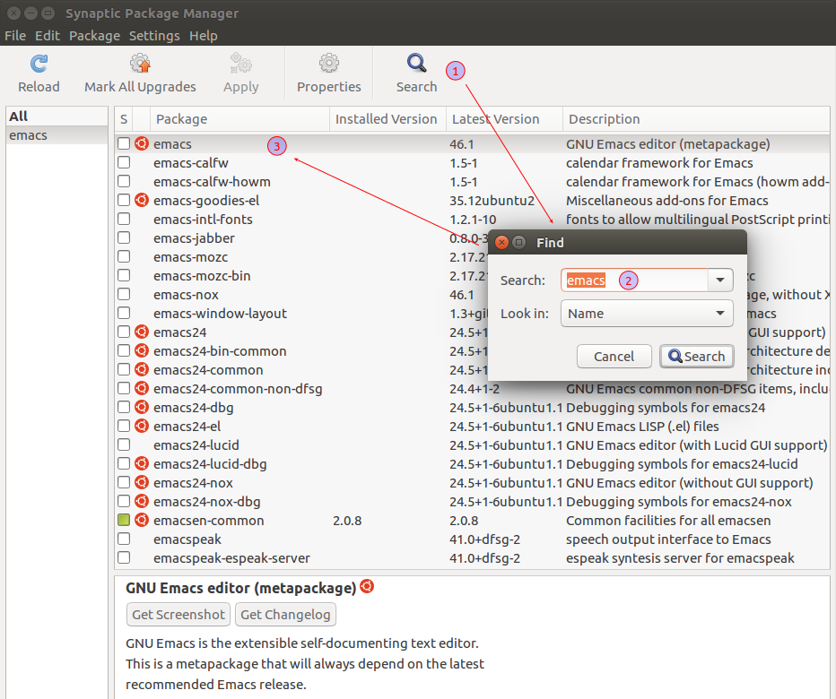
```

Clique com o botão direito do mouse sobre o `emacs` (1) e marque para
instalação completa.  Faça o mesmo com o `emacs-goodies-el` (2).
Perceba que os itens que começam com `emacs24` ficarão todos marcados
quando marcar `emacs`.  Isso porque `emacs` representa essa coleção de
componentes.  Para cada um deles é possível verificar, no espaço
inferior, quais são os pacotes/bibliotecas instaladas (3).  Por fim,
quando todos os itens necessários estiverem marcados, faça a instalação
clicando em *Apply* na barra de tarefas (4).

(ref:syn02) Tela do Synaptic destacando os componentes marcados para
instalação.  No espaço inferior tem-se os pacotes/bibliotecas que são
instalados com a marcação de cada item.

```{r, echo = FALSE, fig.cap = "(ref:syn02)"}
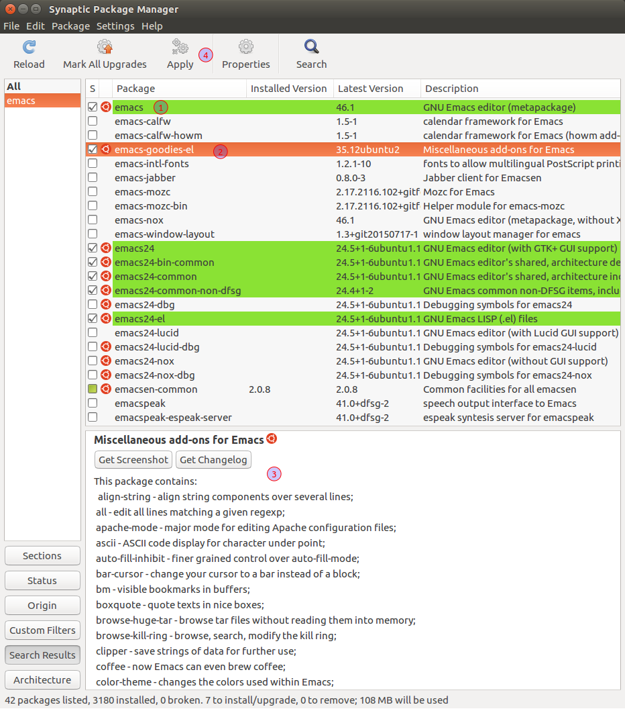
```

Quando pressionar *Apply* uma caixa de diálogo irá mostrar a relação de
componentes a serem instalados e o espaço em disco necessário.  Na
sequência, irá abrir a caixa exibindo o progresso da instalação.

(ref:syn03) Tela do Synaptic com os componentes que serão instalados e o
espaço em disco ocupado (topo) e progresso da instalação (base).

```{r, echo = FALSE, fig.cap = "(ref:syn03)", fig.show = "hold"}
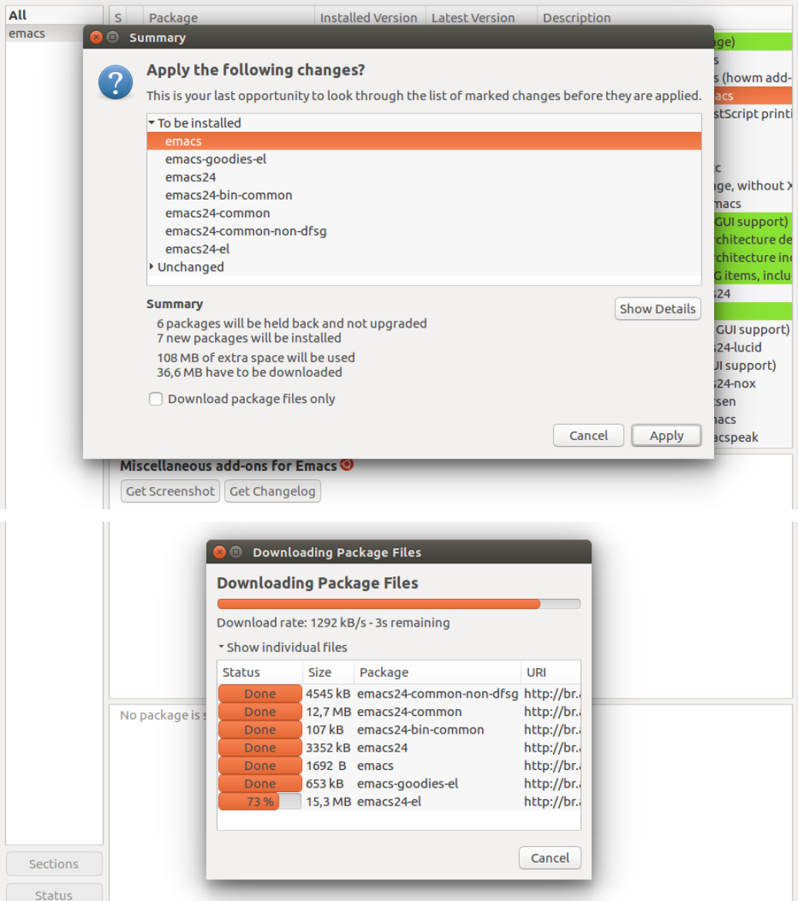
```

Assim que a instalação concluir, a caixa irá fechar e pronto: o GNU
Emacs está instalado no seu Ubuntu.  Procure o GNU Emacs no Ubuntu Dash.
Selecione o GNU Emacs GUI, pois o GNU Emacs Terminal, como o nome
sugere, é uma instância do GNU Emacs no Terminal.  As funcionalidades do
GNU Emacs GUI são maiores.  O GNU Emacs Terminal é mais usado por/para
acesso remoto, por exemplo.

(ref:scr06) Resultado da busca por GNU Emacs no Ubuntu Dash.

```{r scr06, echo = FALSE, fig.cap = "(ref:scr06)"}
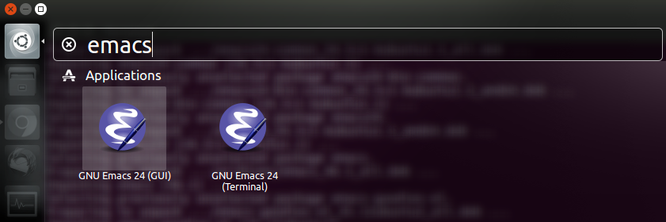
```

(ref:ema07) Tela de boas vindas do GNU Emacs (1).  Essa tela dá acessa a
tutorial e guias sobre o GNU Emacs (2).  Também possibilita abrir
arquivos e customizar o editor (3).  Explore o conteúdo da barra de
menus para se ambientar (4).  A versão do GNU Emacs é exibida como
informação final.  O minibuffer (6) permite acessar a documentação do
editor a qualquer momento.

```{r, echo = FALSE, fig.cap = "(ref:ema07)"}
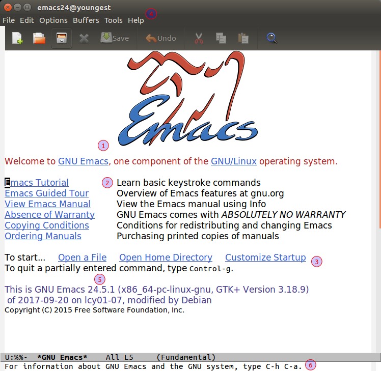
```

## Pelo Terminal

A instalação do GNU Emacs pelo Terminal é bem mais simples e
direta. Guarde esses comandos para instalar de maneira rápida e
assertiva o GNU Emacs em outras ocasiões.  Trata-se de apenas executar
uma linha de comandos no Terminal:

    sudo apt-get install emacs emacs-goodies-el

O Terminal irá exibir os componentes a serem instalados e o espaço em
disco necessário, ou seja, as mesmas informações vistas nas janelas do
Synaptic.  Pressione ENTER para instalar.

(ref:ter05) Tela do Terminal com a instrução para instalar o GNU Emacs
(1), os componentes da instalação (2) e o espaço em disco necessário
(3).

```{r, echo = FALSE, fig.cap = "(ref:ter05)"}
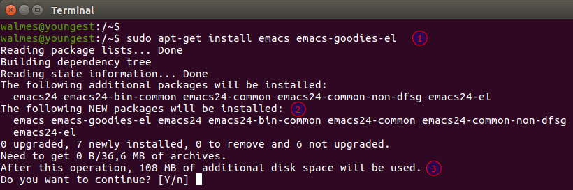
```

# Instalação de pacotes no GNU Emacs

Com a instalação do GNU Emacs e o `emacs-goodies-el`, já se pode editar
vários tipos de arquivos com apropriado suporte pelo editor.  No
entanto, o GNU Emacs contém uma gigantesca biblioteca de pacotes (ou
plugins, se preferir) que habilitam recursos gerais e específicos.
Existem pacotes para se trabalhar com arquivos de linguagens como C,
C++, Shell, Java, HTML, CSS, JavaScript, SQL, LaTeX, Markdown, SAS,
JSON, e obviamente R e Python que são o nosso interesse aqui.

A instalação de pacotes no GNU Emacs também pode ser feita de duas
formas: 1) de maneira gráfica pelo gerenciador de pacotes do próprio
editor ou 2) por execução de comandos LISP no GNU Emacs.

(ref:ema08) Acesse o gerenciador de pacotes pelo menu `Options > Manage
Emacs Packages`.

```{r ema08, echo = FALSE, fig.cap = "(ref:ema08)"}
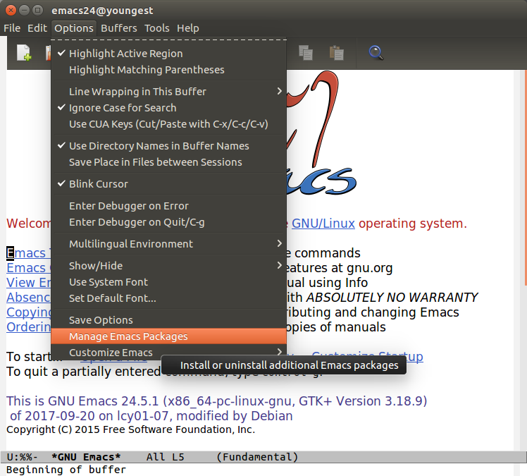
```

Antes de fazermos a instalação propriamente, vamos explorar a coleção de
pacotes disponíveis no repositório oficial do GNU Emacs, o
[ELPA](https://elpa.gnu.org/) (GNU Emacs Lips Package Archive).  Se
estiver com pressa, pule para a instalação.

(ref:ema09) Alguns dos pacotes disponíveis no repositório de pacotes
oficial do GNU Emacs.  Os pacotes `built-in` já estão instalados. O GNU
Emacs já vem com suporte nativo para Shell, SQL, JavaScript, JSON e tem
um o jogo de Tetris embutido para descontração. Não é preciso sair do
GNU Emacs para dar uma jogadinha.

```{r, echo = FALSE, fig.cap = "(ref:ema09)"}
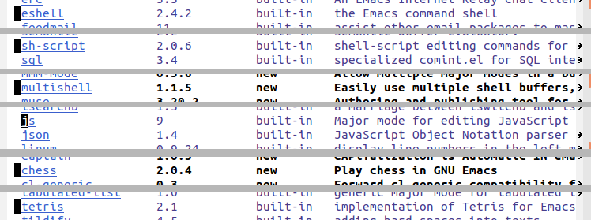
```

O GNU Emacs tem outros repositórios de pacotes além do ELPA, que é o
oficial. O [MELPA](https://melpa.org/#/) (*Milkypostman's Emacs Lisp
Package Archive*) é o mais utilizado e contém bem mais pacotes que o
ELPA.  Para ter acesso ao conteúdo desse repositório, é necessário
adicioná-lo a lista de arquivos de pacotes (ou repositórios) do editor.
Para isso, deve ser criado o arquivo `.emacs` (caso ainda não exista).

Execute o atalho `C-x C-f` (significa `Ctrol + x` seguido de `Ctrol + f`
na convenção GNU Emacs).  O minubuffer irá abrir um diálogo para que
seja informado o caminho para o arquivo.  O arquivo `.emacs` fica na
*home* do usuário, pontanto o caminho para ele é `~/.emacs`.

O arquivo `.emacs` pode ser criado e editado por qualquer editor de
texto.  Então, se preferir, abra no editor que está mais acostumado para
fazer as modificações documenadas aqui.

(ref:ema11) Dialógo no minibuffer do GNU Emacs com o caminho para o
arquivo de configuração `.emacs`.  Pressione ENTER (que é RET na
terminologia do GNU Emacs) para abrir o arquivo.

```{r, echo = FALSE, fig.cap = "(ref:ema11)"}
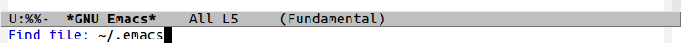
```

O arquivo será criado vazio se não existir até então.  Caso queira, ao
invés de usar a tecla de atalho, utilize o menu `File > Visit New File`
ou clique no primeiro ícone da esquerda (um documento com sinal de + no
canto).  Note que algumas entradas de menu tem a correspondente tecla de
atalho escrita do lado direito.

(ref:ema10) Menu `File` do GNU Emacs.  Dá acesso para ações de abrir
arquivos e outras ações. A tecla de atalho associada a cada ação é
exibida do lado direito.  O emprego delas deixa muito mais ágil o uso de
qualquer editor.

```{r, echo = FALSE, fig.cap = "(ref:ema10)"}
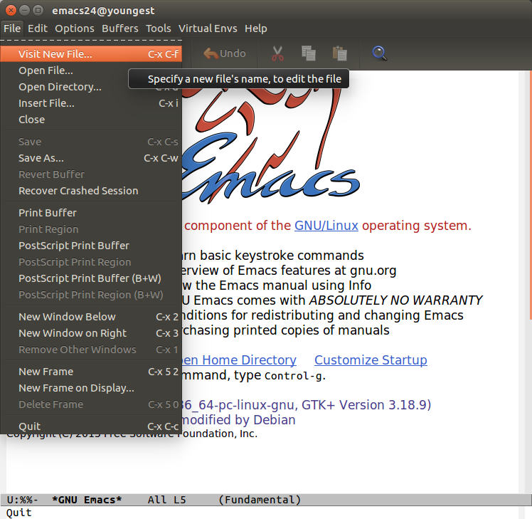
```

Dentro do arquivo é informado o endereço dos repositórios para
instalação de pacotes.  O MELPA possui dois repositórios. O MELPA
estável (<https://stable.melpa.org/>) tem menos pacotes (no caso 1945
pacotes) e assume-se que estão livres de bugs, etc.  O MELPA
(<https://melpa.org/>) que tem mais pacotes (no caso 3828 pacotes) é a
caixa de entrada das contribuições e pode ter pacotes com bugs ainda não
descobertos/resolvidos.  É opcional de onde se irá instalar os pacotes.
É conservador usar o MELPA estável mas os pacotes no MELPA tradicional
estão com versões mais recentes e, portanto, com mais funcionalidades.
Utilize o código do bloco de código após a \@ref(fig:ema12).

(ref:ema12) Arquivo `.emacs` com o a instrução para adicionar o
repositório MELPA à lista de arquivos de pacotes.  No GNU Emacs os
comentários são precedidos de `;`.

```{r ema12, echo = FALSE, fig.cap = "(ref:ema12)"}
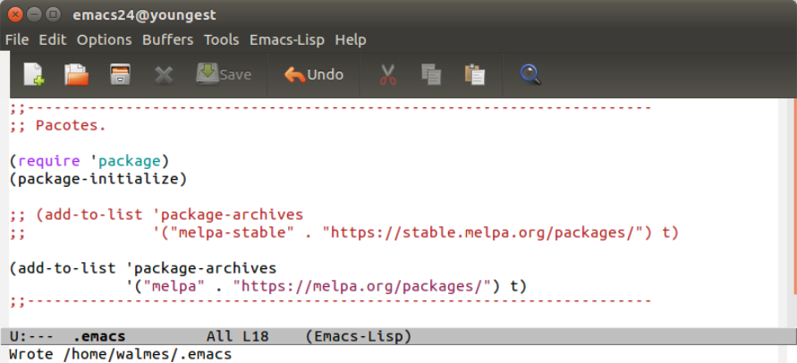
```

```lisp
;;----------------------------------------------------------------------
;; Pacotes.

(require 'package)
(package-initialize)

;; (add-to-list 'package-archives
;;              '("melpa-stable" . "https://stable.melpa.org/packages/") t)

(add-to-list 'package-archives
             '("melpa" . "https://melpa.org/packages/") t)

;;----------------------------------------------------------------------
```

Agora que o MELPA foi adicionado à lista de arquivos de pacotes, é
necessário carregar o arquivo `.emacs` para que as modificações sejam
aplicadas.  Para isso pressione `M-x` (que é `Alt + x` na convenção do
GNU Emacs) e escreva `load-file`, pressione ENTER, dê o caminho
`~/.emacs` e pressione ENTER novamente. Pronto.

Você irá encontrar instruções como essa acima escritas assim pela WEB:

    M-x load-file RET `~/.emacs` RET

Na convenção GNU Emacs `RET` é `ENTER`, `M` é `Alt`, `C` é `Ctrol`.  A
razão por trás dessa convenção é histórica e não vem ao caso.  Porém,
acostume-se com esse padrão porque é o que predomina em forúns sobre o
GNU Emacs, além de ser o padrão da documentação interna e online do
editor.

Caso prefira, uma forma equivalente de carregar o arquivo `.emacs` é
fechar e abrir o GNU Emacs.  Sempre que ele abrir, irá carregar o
arquivo `.emacs`.

(ref:ema13) Carregando o arquivo `.emacs` para que as modificações sejam
aplicadas.

```{r, echo = FALSE, fig.cap = "(ref:ema13)"}
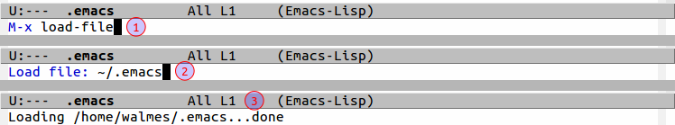
```

Agora que o repositório do MELPA foi adicionado à lista do GNU Emacs,
podemos instalar os pacotes que precisamos: ESS para R e Elpy para
Python.

O [ESS](https://ess.r-project.org/) significa Emacs Speaks
Statistics. Ele dá suporte para se trabalhar com linguagens de
programação de Estatística (R, S-Plus, SAS, Stata and OpenBUGS/JAGS) em
vários sistemas operacionais.

O [Elpy](https://elpy.readthedocs.io/en/latest/) é o pacote que dá o
ambiente de desenvolvimento para Python no Emacs.

## Com o gerenciador de pacotes

Para abrir o gerenciados de pacotes você pode ir pelo menu `Options >
Manage Emacs Packages` conforme ilustra a figura \@ref(fig:ema08).  Ou
escreva no minibfer:

    M-x package-list-packages RET

Os pacotes encontrados nos repositórios serão exibidos em ordem
alfabética.  Percorra o buffer usando seta para cima e para baixo.  Com
o cursor na linha do pacote que deseja instalar pressione a tecla `i`
para marcá-lo para instalação.  Quando todos os pacotes estiverem
marcados, pressione `x` para executar a instalação.  O minibuffer vai
mostrar o progresso da instalação.  Aguarde até que termine.

(ref:ema14) Os pacotes `ess` e `elpy` marcados para instalação (note o
`I` na borda esquerda).  Neste exemplo, ambos serão instalados do MELPA
estável.

```{r, echo = FALSE, fig.cap = "(ref:ema14)"}
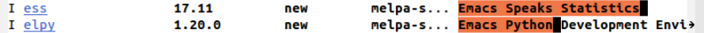
```

(ref:ema16) O minibuffer pede para confirmar a instalação dos pacotes.
Após a instalação o minibuffer informa a quantidade de arquivos
compilados e diretórios.

```{r, echo = FALSE, fig.cap = "(ref:ema16)"}
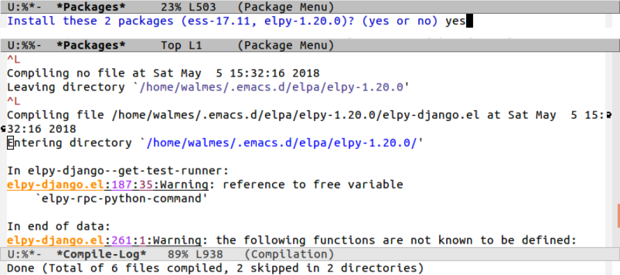
```

Como já foi comentado, o GNU Emacs possui uma gigantesca biblioteca de
pacotes.  Percorra o buffer lendo a descrição de cada um.  Para mais
detalhes sobre, consulte a documentação online dos pacotes no
[MELPA](https://melpa.org/#/).

(ref:ema15) Uma lista de pacotes interessantes para o GNU Emacs.

```{r, echo = FALSE, fig.cap = "(ref:ema15)"}
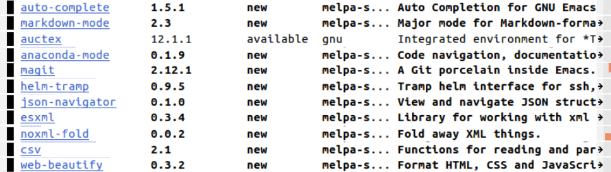
```

Depois que os pacotes forem instalados, diretórios para cada um deles (e
pacotes dos quais dependem) serão criados em `~/.emacs.d/elpa/`.  Após o
nome do pacote tem uma sequência numérica que corresponde a sua versão.
Esteja atento a versão que está usando de cada pacote sempre que se
deparar com alguma infuncionalidade/bug/problema.  Instale a versão mais
recente, caso exista.  Veja a figura \@ref(fig:ter28) como exemplo.

## Com comandos em LISP

A instalação por comandos é bem mais direta e reproduzível.  Se você
guardar as instruções irá instalar os esses e novos pacotes rapidamente
sempre que precisar.

Uma forma de instalar é via minibuffer conforme exemplificado abaixo:

    M-x package-install RET <package_name>

(ref:ema29) A instalação do pacote `magit` para trabalhar com
versionamento Git de dentro do GNU Emacs.  O minibuffer mostra o
progresso da instalação.

```{r, eval = FALSE, echo = FALSE, fig.cap = "(ref:ema29)"}
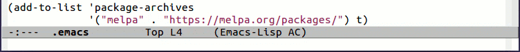
```

<center>


</center>

Uma forma mais conveniente é criar um arquivo de extensão `.el`, por
exemplo `pacotes.el`, que contenha a instrução em LISP para instalar os
pacotes:

    (package-install 'ess)
    (package-install 'elpy)

Abra o arquivo no GNU Emacs e com o cursos posicionado no final de cada
linha pressione o atalho `C-c C-e`.  Esse atalho envia para o
interpretador LISP essa expressão e o pacote será instalado.  Aguarde
até a instalação concluir e vá para o próximo pacote.  É possivel
serializar a instalação dos pacotes, veja um exemplo aqui:
<https://oremacs.com/2015/03/20/managing-emacs-packages/>.

Também é possível fazer a instalação pelo Terminal chamando um script
LISP.  Considere que o conteúdo abaixo esteja no arquivo
`emacs-packs.el`.

```lisp
;; Arquivo: emacs-packs.el. --------------------------------------------

(require 'package)
(package-initialize)

(add-to-list 'package-archives
             '("melpa" . "https://melpa.org/packages/") t)

(package-list-packages)

(package-install 'bm)

;;----------------------------------------------------------------------
```

Abra o terminal e escreva a instrução dando o caminho para o arquivo:

    emacs --script emacs-packs.el

Neste exemplo está sendo instalado o pacote
[`bm`](https://github.com/joodland/bm) que permite marcar linhas dentro
do arquivo para facilmente saltar entre as posições marcadas.

# Habilitar GNU Emacs para R e Python

Para completar, é necessário chamar os pacotes e fazer alguns ajustes
finos.  Nessa customização será adicionado a funcionalidade de auto
complete, que ajuda muito no desenvolvimento de scripts de R e Python.

O auto complete é em recurso genérico que funciona até mesmo no buffer
fundamental, ou seja, na edição de um arquivo `.txt`.  Quando você
começar a escrever uma palavra, o auto complete vai sugerir completar
com palavras similares próximas ao seu ponto de edição.  Para R e
Python, o auto complete sugere nomes de funções e métodos, além de nomes
de objetos presentes no arquivo.  Se você é pouco experiente nessas
liguagens, o auto complete irá auxiliá-lo nas descobertas.

Para instalar o `auto-complete`, execute:

    M-x package-install RET auto-complete RET

Como visto, você pode manter em um arquivo `.el` a instrução LISP abaixo
e enviá-la para o interpretador com `C-c C-e`.

    (package-install 'auto-complete)

Depois de instalar o `auto-complete`, adicione o bloco a seguir no
arquivo `.emacs` para habilitar o recurso.  Para saber mais sobre o auto
complete, visite: <https://www.emacswiki.org/emacs/AutoComplete> e
<https://github.com/auto-complete>.

```lisp
;;----------------------------------------------------------------------
;; Habilitar auto-complete.

(require 'auto-complete-config)
(ac-config-default)
```

## Para scripts Python

A instalação do `elpy` já foi descrita.  O caminho para interpretador
Python é informado alterando a variável de ambiente
`python-shell-interpreter`.

Para ter o recurso de auto completar é preciso instalar o `jedi` e
`jedi-core`.  Eles dependem do `virtualenv` que é instalado via
Terminal.  Os comentários dentro do bloco a seguir contém as instruções
para instalá-los.

(ref:ter25) Terminal com a instalação do `virtualenv`.

```{r, echo = FALSE, fig.cap = "(ref:ter25)"}
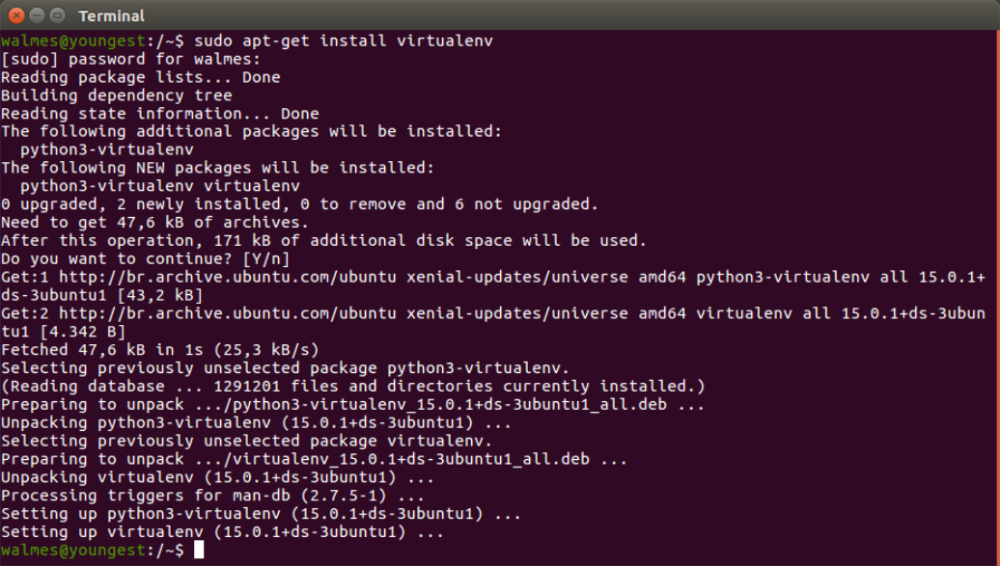
```

(ref:ema26) Versões disponíveis do `jedi` e `jedi-core` no MELPA e MELPA
estável.

```{r, echo = FALSE, fig.cap = "(ref:ema26)"}
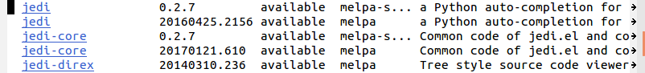
```

```lisp
;;----------------------------------------------------------------------
;; Habilitar Python.

(elpy-enable)
(setq python-shell-interpreter "/usr/bin/python3")

;; Seguir: http://tkf.github.io/emacs-jedi/latest/
;;   Terminal : sudo apt-get install virtualenv
;;   Emacs    : M-x package-install RET jedi RET
;;   Emacs    : M-x jedi:install-server RET

(add-hook 'python-mode-hook 'jedi:setup)
(setq jedi:complete-on-dot t)
```

Para começar, apenas memorize as teclas de atalho a seguir:

  * `C-RET`: envia um linha de código por vez para o
    interpretador/console e move o cursor para a próxima linha.
  * `C-c C-c`: envia o conteúdo de uma região com texto selecionado para
    o interpretador/console.  Se nada estiver selecionado, é enviado o
    conteúdo do buffer inteiro.

(ref:ema19) GNU Emacs no modo de edição para scripts Python.  O menu do
editor contém entradas próprias para ações relacionadas ao Python (1 e
2).  O *major-mode* de edição do arquivo é Python (3) e o console
inferior está com o intepretador Python especificado no `.emacs`.

```{r, echo = FALSE, fig.cap = "(ref:ema19)"}
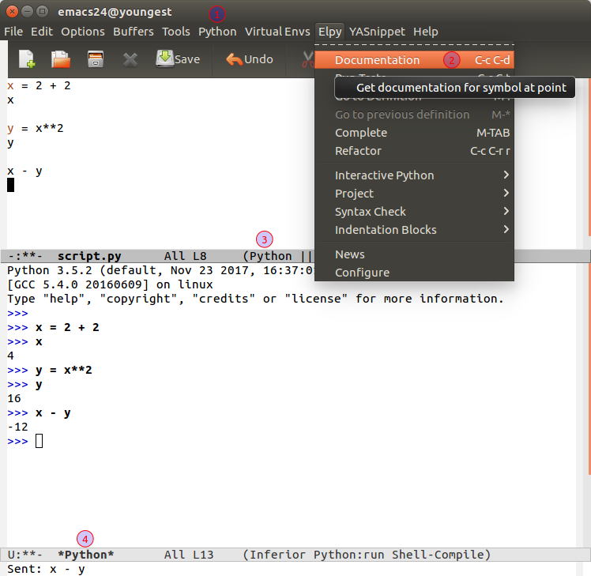
```

(ref:ema27) GNU Emacs com auto complete habilitado para Python.  Após o
ponto abre-se um popup com sugestões de métodos para o objeto (1).  O
`elpy` e `auto-complete` estão ativos como *minor-modes*.

```{r, echo = FALSE, fig.cap = "(ref:ema27)"}
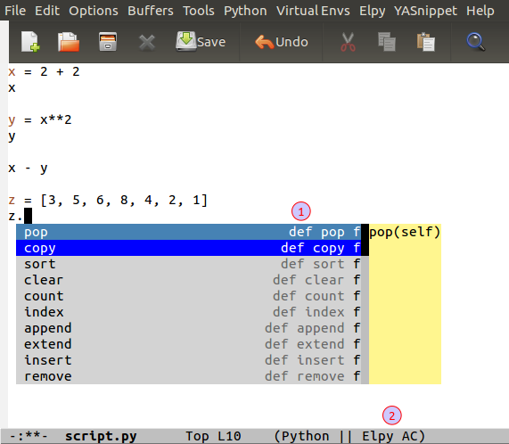
```

## Para scripts R

Para habilitar a edição de scripts R, basta adicionar o conteúdo abaixo
ao `.emacs`.  Essa é a configuração mais minimalista possível.  Ganhe
experiência primeiro para depois fazer personalização fina nas opções.

```lisp
;;----------------------------------------------------------------------
;; Habilitar R.

;; ESS - Emacs Speaks Statistics.
;; http://ess.r-project.org/
;; http://members.cbio.mines-paristech.fr/~thocking/primer.html

(require 'ess-eldoc)
(setq-default ess-dialect "R")
```

Para começar, apenas memorize as teclas de atalho a seguir:

  * `C-RET` e `C-c C-n`: enviam um linha de código por vez para o
    interpretador/console e movem o cursor para a próxima linha.
  * `C-c C-c` e `C-c C-p`: enviam um parágrafo de código por vez para o
    interpretador e movem o cursor para o próximo parágrafo.

(ref:ema20) GNU Emacs no modo de edição para scripts R.  O menu do
editor contém entradas próprias para ações relacionadas ao R via o ESS
(1).  O *major-mode* de edição do arquivo é o `ess-mode` e o console
inferior está com R.  O minibuffer mostra os primeiros argumentos de uma
função quando o cursor está no espaço dos argumentos.

```{r, echo = FALSE, fig.cap = "(ref:ema20)"}
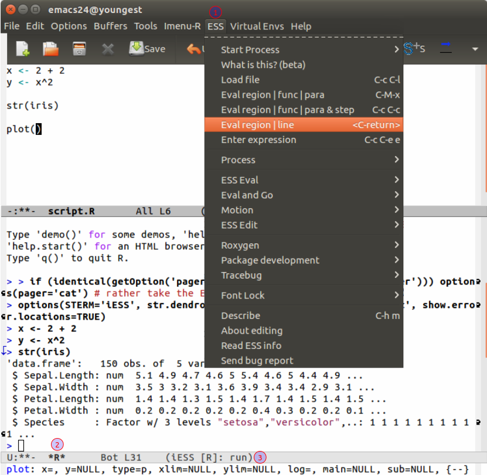
```

(ref:ema23) GNU Emacs com auto complete habilitado para R.  Após dois
caracteres o abre um popup com sugestões texto.  A documentação é
exibida se o objeto estiver documentado.

```{r, echo = FALSE, fig.cap = "(ref:ema23)"}
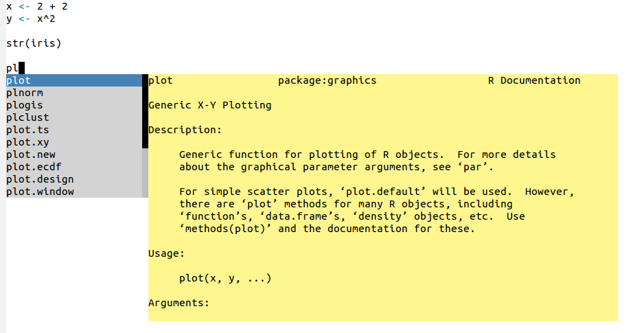
```

# Resumão para o impaciente

Se você já tem experiência e quer rapidamente instalar e configurar o
Emacs, siga os passos a seguir.

  1. Instale o GNU Emacs pelo terminal:

        sudo apt-get install emacs emacs-goodies-el virtualenv
  2. Crie o arquivo `emacs-packs.el` com o seguinte conteúdo:

        ;; Arquivo: emacs-packs.el. --------------------------------------------

        (require 'package)
        (package-initialize)

        (add-to-list 'package-archives
                     '("melpa" . "https://melpa.org/packages/") t)

        (package-list-packages)

        (package-install 'ess)
        (package-install 'elpy)
        (package-install 'auto-complete)
        (package-install 'jedi)
        (package-install 'jedi-core)

        ;;----------------------------------------------------------------------
  3. Faça a instalação dos pacotes pelo terminal:

        emacs --script emacs-packs.el
  4. Adicione no `~/.emacs` o conteúdo para que fique assim:

        ;;----------------------------------------------------------------------
        ;; Pacotes.

        (require 'package)
        (package-initialize)

        (add-to-list 'package-archives
                     '("melpa" . "https://melpa.org/packages/") t)

        ;;----------------------------------------------------------------------
        ;; Habilitar auto-complete.

        (require 'auto-complete-config)
        (ac-config-default)

        ;;----------------------------------------------------------------------
        ;; Habilitar Python.

        (elpy-enable)
        (setq python-shell-interpreter "/usr/bin/python3")

        ;; Seguir: http://tkf.github.io/emacs-jedi/latest/
        ;;   Terminal : sudo apt-get install virtualenv
        ;;   Emacs    : M-x package-install RET jedi RET
        ;;   Emacs    : M-x jedi:install-server RET

        (add-hook 'python-mode-hook 'jedi:setup)
        (setq jedi:complete-on-dot t)

        ;;----------------------------------------------------------------------
        ;; Habilitar R.

        ;; ESS - Emacs Speaks Statistics.
        ;; http://ess.r-project.org/
        ;; http://members.cbio.mines-paristech.fr/~thocking/primer.html

        (require 'ess-eldoc)
        (setq-default ess-dialect "R")

        ;;----------------------------------------------------------------------
  5. A primeira vez que abrir o GNU Emacs, termine a instalação do `jedi` executando:

        M-x jedi:install-server RET


Após instalar todos os componentes, o diretório `~/.emacs.d/elpa/`
deverá ter o seguinte conteúdo (a menos das versões dos pacotes).

(ref:ter28) Lista de pacotes instalados para habilitar R e Python no GNU
Emacs.

```{r ter28, echo = FALSE, fig.cap = "(ref:ter28)"}
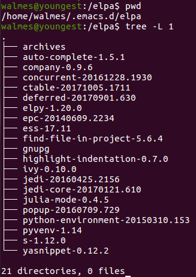
```

Agora o GNU Emacs está habilitado para trabalhar com o R e Python.

# Para Windows e Mac OS

Para Windows e Mac OS é recomendado instalar o Emacs disponibilizado por
[Vicent Goulet](https://vgoulet.act.ulaval.ca/en/home/).  Na página dele
estão versões para [Mac
OS](https://vigou3.github.io/emacs-modified-macos) e
[Windows](https://vigou3.github.io/emacs-modified-windows).  No entanto,
de acordo com a descrição, o Python não vem habilitado nelas.  Dessa
forma, siga as mesmas etapas de instalação indicadas acima usando o
gerenciador de pacotes do GNU Emacs.

<!-- %% END %% -->

```{sh, eval = FALSE, include = FALSE}
# Encontrar linha da marca START.
START=$(awk '/%% START %%/{print NR}' guide.html)
echo $START

# Encontrar linha da marca END.
END=$(awk '/%% END %%/{print NR}' guide.html)
echo $END

# Jogar para arquivo conteúdo entre as marcas.
sed -n "$START","$END"p guide.html > post.html

# Substituir `img/` por URL.
URL="http://blog.leg.ufpr.br/wp-content/uploads/2018/05/"
sed -i "s|img/|$URL|" post.html

# Trocar `Figure` por `Figura`.
sed -i "s|Figure|Figura|" post.html
```
