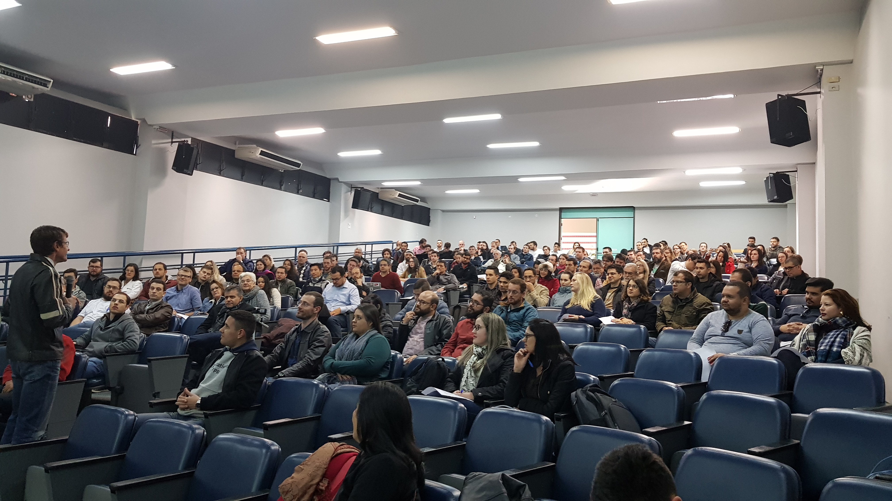
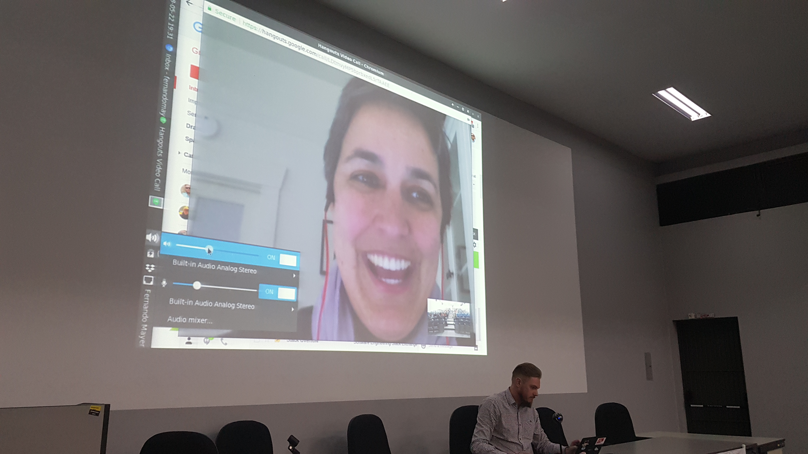
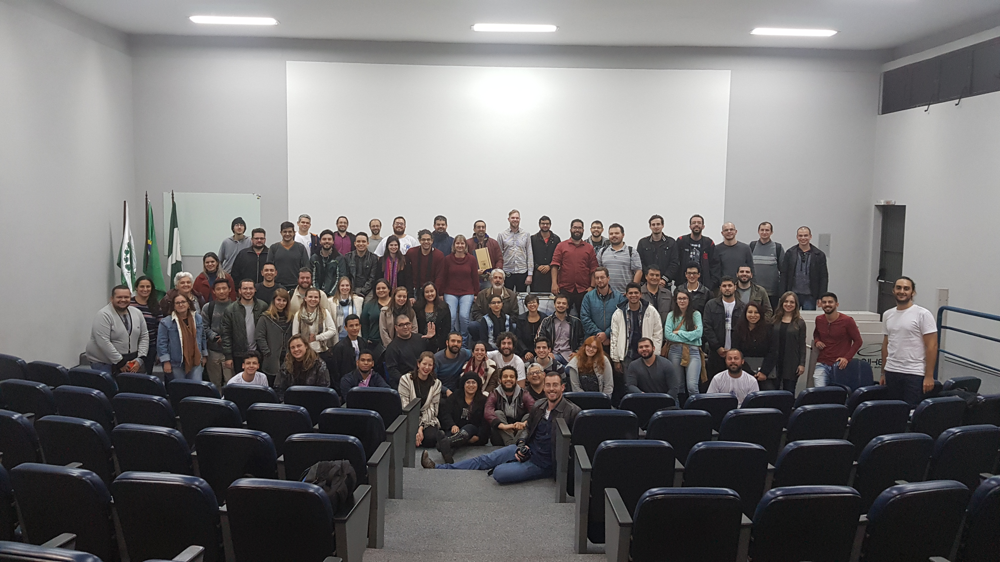

```{r, echo=FALSE, message=FALSE, results='hide'}
dados <-
    read.table("r-day-inscricao-v1-30-05-2018-17-55-05.csv",
               header = TRUE, sep = ";", dec = ",",
               stringsAsFactors = FALSE)
str(dados)
names(dados)
dados <- dados[, c(1,2,4,5,6,8,9)]
names(dados) <- c("cod", "nome", "cidade", "inst", "cat", "lat", "lon")
str(dados)
unique(dados$cidade)
unique(dados$cat)
unique(dados$lat)
unique(dados$lon)
unique(dados$nome)
## Remove nomes duplicados
dados <- dados[!duplicated(dados$nome), ]
dim(dados)
```

O **[R Day - Encontro nacional de usuários do
R](http://rday.leg.ufpr.br/)** aconteceu no dia 22 de maio de 2018 no
Campus Jardim Botânico da UFPR. Foi o primeiro evento no Brasil
oficialmente endossado pela **[The R
Foundation](https://www.r-project.org/foundation/)**, fundação
responsável por gerenciar todas as atividades relacionadas à linguagem
R.

O R Day foi concebido para ser um evento satélite da **[63ª RBRAS (Reunião
Anual da Região Brasileira da Sociedade Internacional de
Biometria)](http://www.rbras.org.br/rbras63/)**, que
estava programada para acontecer na UFPR, em Curitiba, desde 2016. Para a UFPR, o R Day
foi criado como um evento de extensão, portanto sem fins
lucrativos e com inscrições gratuitas. Ao total,
`r length(unique(dados$nome))` pessoas estavam inscritas. O gráfico
abaixo mostra o número de inscritos por categoria (estudante,
profissional ou outro segmento).

```{r, echo=FALSE, message=FALSE, out.width='50%', fig.width=7,fig.height=5,fig.align='center'}
library(dplyr)
library(ggplot2)

tab <-
    dados %>%
    group_by(cat) %>%
    summarise(count = length(cat))

ggplot(tab, aes(x = reorder(cat, count), y = count)) +
    geom_bar(stat = "identity") +
    coord_flip() +
    ylab("Frequência") + xlab("")
```

Através do geolocalização das respostas, obtido através do
formulário de inscrição, podemos ver que houveram inscritos de todas as
regiões do país. O mapa abaixo mostra a posição de
`r sum(!is.na(dados$lat))` inscritos, que compartilharam sua locaização.
No entanto, já podemos ter uma ideia da abrangência do evento.

```{r,echo=FALSE,message=FALSE,warning=FALSE,fig.align='center',fig.width=6,fig.height=6,out.width='50%',cache=TRUE}
library(ggmap)

dados2 <- subset(dados, lon < 100)

mapa <- get_map(location = c(lon = mean(dados2$lon),
                             lat = mean(dados2$lat)),
                zoom = 4, scale = 2)

ggmap(mapa) +
    geom_point(data = dados2, aes(x = lon, y = lat, alpha = 0.8),
               size = 4) +
    guides(fill = FALSE, alpha = FALSE, size = FALSE) +
    scale_x_continuous(limits = c(-75, -30), expand = c(0,0)) +
    scale_y_continuous(limits = c(-35, 5), expand = c(0,0)) +
    xlab("Longitude") + ylab("Latitude")
```

O mais importante é que o evento foi pensado para ser guiado pela comunidade, por isso
foram abertas propostas para apresentações orais e tutoriais. Foram
recebidas 25 propostas para apresentações orais e 14 para tutoriais.
Todas as propostas foram de excelente qualidade, mas devido à restrição
de tempo e espaço para acomodar atividades em paralelo, foram selecionadas 18 apresentações orais e 8 tutoriais, dos
mais variados temas relacionados ao R.

```{r, echo=FALSE, out.width='80%',fig.align='center',fig.cap='Prof. Paulo Justiniano (LEG) na palestra de abertura.'}

```

Além de todas estas apresentações, ocorreram 3 conferências principais,
realizadas por pessoas convidadas pela comissão organizadora. O primeiro
conferencista foi o professor do Departamento de Estatística da UFPR, e
membro do LEG, Paulo Justiniano Ribeiro Jr. Ele falou sobre a
história do projeto R e suas experiências pessoais, que se confundem com
a história do R no Brasil. Sua palestra virou [matéria aqui no
blog](http://blog.leg.ufpr.br/archives/432), e o vídeo completa dessa
apresentação também está disponível (ver link na matéria). O professor
Paulo foi e é uma das importantes personalidades ligadas com a difusão
do R nacionalmente.

O segundo palestrante foi Rondon de Andrade Porto, cientista de dados do Conselho Nacional
de Justiça (CNJ), que mostrou como o R é utilizado para gerar
visualizações e relatórios dinâmicos no CNJ. A conferência de
encerramento foi realizada pela Gabriela de Queiroz, fundadora do R
Ladies, que contou como surgiu o R Ladies e o importante papel que essa
comunidade tem na difusão do uso do R no Brail e no mundo.

```{r, echo=FALSE, out.width='80%',fig.align='center',fig.cap='Gabriela de Queiroz (R Ladies) em sua apresentação remota.'}

```

Pelo número de participantes e o *feedback* positivo que temos recebido,
vemos que existe uma demanda muito grande por eventos que reunam usuários de R no
Brasil. Hoje em dia a comunidade que usa a linguagem no país é bastante grande,
diversificada e esparsa. Por isso, o objetivo é tornar o R Day um evento anual a
nível nacional que permita difusão de conhecimento e criação de rede de relacionamentos.
Além disso, contando com a tradição do uso e difusão do
R pela UFPR, esperamos em algum momento também sediar uma useR!, o
evento internacional "oficial" do R.

```{r, echo=FALSE, out.width='80%',fig.align='center',fig.cap='Participantes do R Day que ficaram até o final do evento.'}

```

Você pode ver mais fotos do evento neste
[álbum](https://www.facebook.com/media/set/?set=a.1010180265804681.1073741833.934474600041915&type=1&l=b06fdaad14).
Os materias (slides, scripts, etc) utilizados pelos apresentadores estão
disponíveis nesta [página](http://rday.leg.ufpr.br/materiais.html).

Agradecemos a todos que compareceram, e especialmente aos apresentadores
que se disponibilizaram e fizeram o evento acontecer da melhor forma
possível. Também agradecemos aos nossos
[patrocinadores](http://rday.leg.ufpr.br/apoio.html) pelo apoio
financeiro, à "The R Foundation" pelo reconhecimento do R Day e a
sociedade científica da RBras que apoiou a iniciativa de ter o R Day
como evento satélite da 63ª Reunião da RBras.
